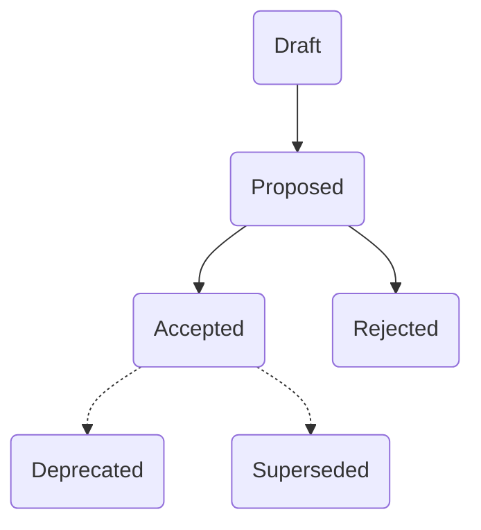

# ADR

This directory contains decision records for {project name}.

For new ADRs, use [_adr-template.md](_adr-template.md) as basis.

## Lifecycle

```mermaid
graph TD
  A(Draft) --> B(Proposed)
  B --> C(Accepted)
  B --> D(Rejected)
  C -.-> E(Deprecated)
  C -.-> F(Superseded)
```
