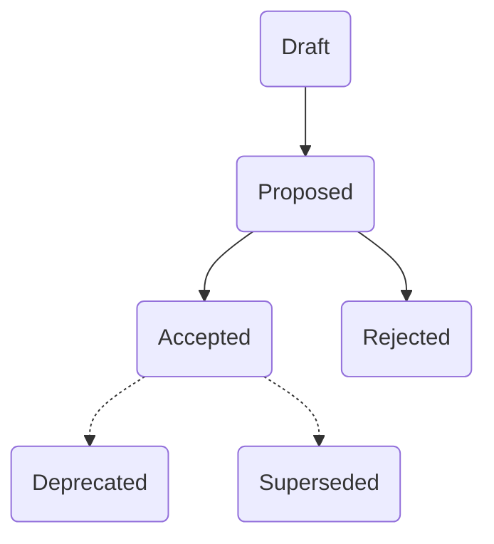
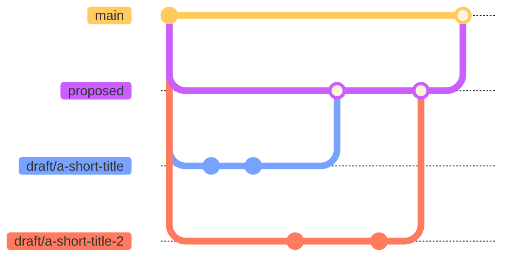

# ADR

This directory contains decision records for {project name}.

For new ADRs, use [template.md](template.md) as basis.

## Statuses



## Workflow

To add a new record :

1. Create a new branch from `proposed` branch named `draft/a-short-title`
2. Create a new file in the `proposed` directory, prefixed with `DRAFT` while its writing is not done
3. When ready
   - change the badge to `proposed`
   - replace `DRAFT` with a number in the file name
   - update the date badge to today if needed
   - merge the draft branch into the `proposed` branch
4. Team-review all the proposed records and
   - move them to the `accepted` or `rejected` directories, changing badges accordingly
   - update the date badge to today if needed
   - merge the `proposed` branch into the `main` branch



## File naming conventions

```text
PREFIX-title.md
```

Where :

- `PREFIX`
  - If _draft_ : "DRAFT"
  - If other status : a unique number increasing from 0001 to 9999
- `title` is short, snake case and
  - If _draft_ : describes the problem
  - If other status : describes the outcome

Examples :

- 0001-use-sql-server-database.md
- 0002-write-code-in-english.md
- DRAFT-choose-javascript-framework.md
