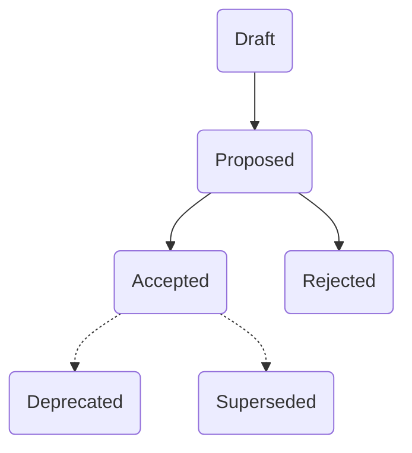

# ADR

This directory contains decision records for {project name}.

For new ADRs, use [template.md](template.md) as basis.

## Statuses



## Naming conventions

## File name

```text
PREFIX-title.md
```

Where :

- `PREFIX`
  - If _draft_ : "DRAFT"
  - If other status : a unique number increasing from 0001 to 9999
- `title` is short, snake case and
  - If _draft_ : describes the problem
  - If other status : describes the outcome

Examples :

- 0001-use-sql-server-database.md
- 0002-write-code-in-english.md
- DRAFT-choose-javascript-framework.md
